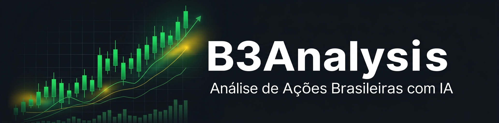

# B3Analysis




Análise de ações brasileiras (B3) com **agent swarm** — equipes de agentes especializados em paralelo usando Claude Code. Sem API keys: todos os dados vêm de fontes públicas (yfinance, BCB, Google News RSS).

---

## Início rápido

```bash
git clone https://github.com/guhcostan/b3analysis.git
cd b3analysis

# Ultra-análise com swarm de 9 agentes
/b3:swarm WEGE3.SA

# Análise completa (3 agentes)
/b3:analyze WEGE3.SA

# Carteira diversificada
/b3:portfolio elite 10000

# Snapshot macro
/b3:macro
```

O ambiente Python (`.venv`) é criado automaticamente na primeira execução. Nenhum setup manual necessário.

---

## Comandos

| Comando | Exemplo | Descrição |
|---|---|---|
| `/b3:swarm` | `/b3:swarm WEGE3.SA` | Ultra-análise com 12 agentes em 3 ondas (processo buy-side) |
| `/b3:analyze` | `/b3:analyze WEGE3.SA 2026-03-24` | Análise completa com técnica, fundamentos e macro |
| `/b3:portfolio` | `/b3:portfolio elite 10000` | Carteira com alocação otimizada por conviction |
| `/b3:macro` | `/b3:macro` | Painel de indicadores BCB + notícias macro |
| `/b3:profile` | `/b3:profile quality` | Troca o perfil de qualidade/custo dos agentes |

### Presets de carteiras

| Preset | Tickers |
|---|---|
| `elite` | WEGE3, ITUB3, BBAS3, RADL3, LREN3, EQTL3, RENT3, PSSA3, FLRY3, TOTS3 |
| `elite-plus` | Elite + BBSE3, SAPR3 |
| `blue-chips` | PETR4, VALE3, ITUB4, BBDC4, ABEV3, WEGE3, RENT3, SUZB3, EQTL3, BBAS3 |

---

## Perfis de análise

Controla qual modelo Claude usa por tipo de agente. Troque com `/b3:profile`.

| Perfil | Síntese | Agentes ticker | Agente macro | Quando usar |
|---|---|---|---|---|
| `quality` | claude-opus-4-6 | claude-opus-4-6 | claude-sonnet-4-6 | Decisão real de investimento |
| `balanced` | claude-sonnet-4-6 | claude-sonnet-4-6 | claude-haiku-4-5 | Padrão — bom equilíbrio |
| `budget` | claude-sonnet-4-6 | claude-haiku-4-5 | claude-haiku-4-5 | Screening rápido |

Para máxima qualidade na síntese, combine `quality` com `/effort high`.

---

## Metodologia

Baseada na tier list B3 do Logan. Os critérios 1, 2 e 3 são **eliminatórios** — a empresa falha em qualquer um e vai direto para EVITAR.

| # | Critério | Eliminatório |
|---|---|---|
| 1 | **Lucros crescentes (escadinha)** — padrão consistente, sem prejuízos recorrentes | ✅ Sim |
| 2 | **ON com liquidez (final 3)** — vol > R$ 10M/dia; só PN/Unit = descartado | ✅ Sim |
| 3 | **Sem IPO recente** — mínimo 5+ anos de histórico de lucros na B3 | ✅ Sim |
| 4 | Novo Mercado (maior governança da B3) | Parcial |
| 5 | Tag Along 100% (proteção ao minoritário) | Parcial |
| 6 | Dívida controlada (caixa líquido ou D/EBITDA < 2x) | Parcial |
| 7 | Retorno esperado > CDI (~14,75% a.a.) | Parcial |

### Sinais de alerta

- Ticker final 4/11 sem ON com liquidez — empresa quer capital sem perder controle
- Controlador com só ON, força investidor a entrar por PN — desalinhamento
- Tag Along < 100%
- Interferência estatal forte (risco de dividendos e precificação)
- D/EBITDA > 3x
- Setor cíclico de commodity sem histórico multi-décadas consistente

---

## Agent Teams & Swarm Architecture

O B3Analysis é construído em 3 camadas de **parallel agent dispatch**:

### Camada 1 — Agentes de dados (coleta paralela)

Cada agente busca uma fonte de dados independente e retorna output bruto:

```
stock-analyst    → yfinance: OHLCV + técnicos + fundamentos
macro-analyst    → BCB API: Selic, CDI, IPCA, câmbio, fiscal
news-analyst     → Google News RSS: notícias PT-BR por ticker/setor
```

### Camada 2 — Swarm analítico (7 especialistas em paralelo)

O `/b3:swarm` passa os dados brutos para 7 agentes analíticos simultaneamente, cada um com mandato restrito inspirado em papéis reais de gestoras buy-side:

```
/b3:swarm WEGE3.SA
       │
       ├─▶ [stock-analyst]    fetch_stock.py ──────────────┐
       ├─▶ [macro-analyst]    fetch_macro.py ──────────────┤ RAW DATA
       └─▶ [news-analyst]     fetch_news.py 30d ───────────┘
                                                            │
           ┌────────────────────────────────────────────────▼───────────────────┐
           │               AGENT SWARM (7 em paralelo)                          │
           ├──────────────────────────┬─────────────────────────────────────────┤
           │  business-analyst        │  financial-analyst                      │
           │  ↳ moat, gestão, setor   │  ↳ escadinha, margens, ROE, FCF         │
           ├──────────────────────────┼─────────────────────────────────────────┤
           │  credit-analyst          │  valuation-analyst                      │
           │  ↳ D/EBITDA, stress test │  ↳ E/P vs CDI, múltiplos, preço-alvo    │
           ├──────────────────────────┼─────────────────────────────────────────┤
           │  technical-analyst       │  macro-correlation-analyst              │
           │  ↳ SMA/RSI/MACD/ADX      │  ↳ Selic/BRL/IPCA impact no setor       │
           ├──────────────────────────┴─────────────────────────────────────────┤
           │  governance-analyst                                                 │
           │  ↳ ON/liquidez (critério 2), tag along, Novo Mercado, risco estatal │
           └────────────────────────────────────────────────────────────────────┘
                                                            │
                                           ▼ Onda 3 (sequencial)
                                       bear-analyst
                                       ↳ ataca as 3 hipóteses mais fracas
                                       ↳ propõe cenário pessimista + preço-alvo bear
```

### Camada 3 — Devil's advocate + Síntese (modelo principal)

O `bear-analyst` lê todos os 7 outputs e sistematicamente desafia o bull case antes da síntese. O modelo da sessão principal age como portfolio manager: pesa bull vs bear, verifica os critérios eliminatórios e produz o relatório final em PT-BR com veredicto e gestão de risco.

---

## Arquitetura

```
.claude/
    commands/b3/         ← Slash commands /b3:* (orquestração de agent teams)
        swarm.md         → /b3:swarm — 12 agentes em 3 ondas (flagship)
        analyze.md       → /b3:analyze — 3 agentes em paralelo (ação + macro + notícias)
        portfolio.md     → /b3:portfolio — N+1 agentes (1 por ticker + macro)
        macro.md         → /b3:macro — Snapshot macroeconômico BCB
        profile.md       → /b3:profile — Troca o perfil de modelo
    agents/              ← 12 agentes registrados em 3 tiers
        [Tier 1 — dados]
        stock-analyst    → Coleta: OHLCV + técnicos + fundamentos
        macro-analyst    → Coleta: indicadores BCB
        news-analyst     → Coleta: notícias PT-BR RSS
        [Tier 2 — análise especializada, 7 em paralelo]
        business-analyst        → Moat, gestão, dinâmicas do setor
        financial-analyst       → Escadinha, margens, ROE, FCF (critérios 1+3)
        credit-analyst          → D/EBITDA, liquidez, stress test Selic
        valuation-analyst       → 3 métodos: E/P vs CDI, múltiplos, FCF/DDM
        technical-analyst       → SMA, RSI, MACD, Bollinger, ADX
        macro-correlation-analyst → Impacto Selic/BRL/IPCA no setor
        governance-analyst      → ON/liquidez (critério 2), tag along, Novo Mercado
        [Tier 3 — adversarial, sequencial]
        bear-analyst            → Devil's advocate: ataca hipóteses fracas, bear case
    hooks/               ← Hooks Claude Code (validação + detecção de erros)
    skills/b3-analysis/  ← Conhecimento de domínio (checklist, técnicos, setores)

scripts/
    fetch_stock.py       → OHLCV + técnicos + fundamentos (365 dias)
    fetch_macro.py       → Indicadores BCB + histórico Selic + notícias macro
    fetch_news.py        → Notícias PT-BR por ticker + setor (Google News RSS)

dataflows/
    y_finance.py         → OHLCV, fundamentos, DRE, balanço, fluxo de caixa
    bcb_data.py          → Selic, CDI, IPCA, IGP-M, câmbio via API pública BCB
    google_news_br.py    → Notícias financeiras PT-BR via Google News RSS
    stockstats_utils.py  → RSI, MACD, Bollinger, SMA, ADX, ATR via stockstats
    config.py            → Cache local em dataflows/data_cache/
```

### Fluxo de execução `/b3:analyze`

```
/b3:analyze WEGE3.SA
    │
    ├─▶ [Agente 1] fetch_stock.py WEGE3.SA      ─┐
    ├─▶ [Agente 2] fetch_macro.py               ─┼─▶ Síntese (modelo principal)
    └─▶ [Agente 3] fetch_news.py WEGE3.SA 21d   ─┘         │
                                                             ▼
                                              Relatório completo em PT-BR
```

### Fluxo de execução `/b3:portfolio`

```
/b3:portfolio elite 10000
    │
    ├─▶ [Agente macro]   fetch_macro.py          ─┐
    ├─▶ [Agente WEGE3]   fetch_stock + fetch_news ┤
    ├─▶ [Agente ITUB3]   fetch_stock + fetch_news ┤
    ├─▶ [...]            ...                      ┼─▶ Síntese → Alocação final
    └─▶ [Agente TOTS3]   fetch_stock + fetch_news ─┘
```

---

## Fontes de dados

| Fonte | O que fornece | Autenticação |
|---|---|---|
| [Yahoo Finance](https://finance.yahoo.com) via `yfinance` | OHLCV, fundamentos, DRE, balanço, fluxo de caixa | Nenhuma |
| [BCB API aberta](https://dadosabertos.bcb.gov.br) | Selic, CDI, IPCA, IGP-M, câmbio, dívida/PIB | Nenhuma |
| [Google News RSS](https://news.google.com) | Notícias financeiras PT-BR | Nenhuma |

---

## Dependências

```
yfinance==1.2.0
stockstats==0.6.8
pandas==3.0.1
requests==2.32.5
python-dateutil==2.9.0.post0
```

Python 3.10+. Gerenciado automaticamente pelo `run.sh`.

---

## Contexto macro (atualizar periodicamente)

- **Selic meta**: ~14,75% a.a. (ciclo de alta, 2025–2026)
- **CDI** é o benchmark mínimo de retorno para renda variável
- **IPCA elevado** comprime margens de empresas com custo fixo alto
- **BRL/USD**: moeda fraca favorece exportadoras; importadoras e endividadas em dólar sofrem

---

## Referências e inspirações

- **[TradingAgents](https://github.com/TauricResearch/TradingAgents)** — arquitetura multi-agente para análise financeira que inspirou o design deste projeto
- **[Investimentos em Evidência](https://www.youtube.com/@investimentosemevidencia)** — canal do Logan, fonte da metodologia de qualidade B3 (tier list, critérios eliminatórios, escadinha de lucros)
